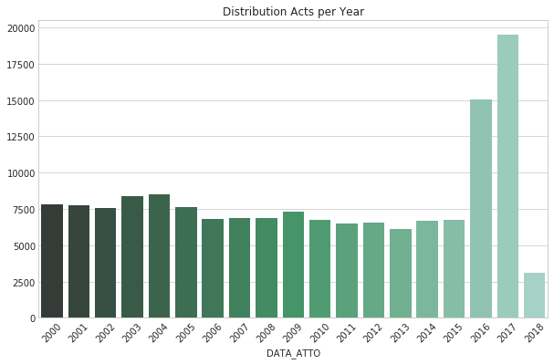
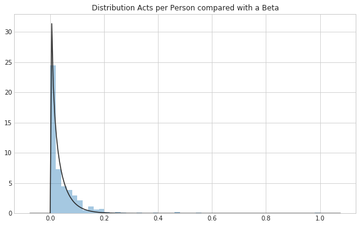
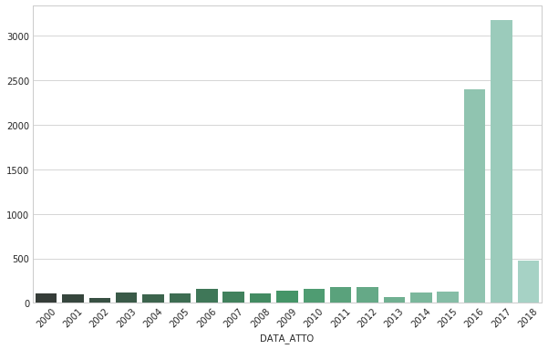

# Data Exploration

Before to start building the classifier we are going to perform some exploration on the dataset.

```python
df = pd.read_pickle('../data/atti-dirigenti.pkl')
df.shape
```
The dataset is compose by 153206 rows and 13 columns.
Below you can see the first five columns of the dataset.

```python
df.head(5)
```

<table border="1" class="dataframe">
  <thead>
    <tr style="text-align: right;">
      <th></th>
      <th>CODICE_PRATICA</th>
      <th>DATA_ATTO</th>
      <th>DESCRIZIONE_TIPO_PRATICA</th>
      <th>ID_TIPO</th>
      <th>ID_TIPO_PRATICA</th>
      <th>LINK_CONTENUTO_BINARIO</th>
      <th>OGGETTO</th>
      <th>PERSONA</th>
      <th>STATUS</th>
      <th>UFFICIO_AC</th>
      <th>UFFICIO_DG</th>
      <th>UFFICIO_SE</th>
      <th>DETAIL_URL</th>
    </tr>
  </thead>
  <tbody>
    <tr>
      <th>0</th>
      <td>20160140002016AD00000017201</td>
      <td>2016-12-19</td>
      <td>Atto dei dirigenti</td>
      <td>ADN</td>
      <td>MON</td>
      <td>http://www.regione.toscana.it/bancadati/atti/C...</td>
      <td>DGR 968/07 e s.m.i. Accreditamento degli organ...</td>
      <td>013910</td>
      <td>2</td>
      <td>00000</td>
      <td>50125</td>
      <td>05873</td>
      <td>http://www.regione.toscana.it/bancadati/atti/D...</td>
    </tr>
    <tr>
      <th>1</th>
      <td>20160140012016AD00000017466</td>
      <td>2016-12-21</td>
      <td>Atto dei dirigenti</td>
      <td>ADN</td>
      <td>MON</td>
      <td>http://www.regione.toscana.it/bancadati/atti/C...</td>
      <td>REG. CEE 2080/92 - AIUTI ALLE MISURE FORESTALI...</td>
      <td>005595</td>
      <td>2</td>
      <td>00000</td>
      <td>50117</td>
      <td>05015</td>
      <td>http://www.regione.toscana.it/bancadati/atti/D...</td>
    </tr>
    <tr>
      <th>2</th>
      <td>20160140022016AD00000017198</td>
      <td>2016-12-19</td>
      <td>Atto dei dirigenti</td>
      <td>ADN</td>
      <td>MON</td>
      <td>http://www.regione.toscana.it/bancadati/atti/C...</td>
      <td>Servizi autorizzati ex art.14 L.R. 42/98 "Norm...</td>
      <td>019075</td>
      <td>2</td>
      <td>00000</td>
      <td>50121</td>
      <td>04838</td>
      <td>http://www.regione.toscana.it/bancadati/atti/D...</td>
    </tr>
    <tr>
      <th>3</th>
      <td>20160140032016AD00000017208</td>
      <td>2016-12-19</td>
      <td>Atto dei dirigenti</td>
      <td>ADN</td>
      <td>MON</td>
      <td>http://www.regione.toscana.it/bancadati/atti/C...</td>
      <td>L.R. 1/2006, DCR 3/2012, L.R. 1/2015 art.29, c...</td>
      <td>020415</td>
      <td>2</td>
      <td>00000</td>
      <td>50117</td>
      <td>05018</td>
      <td>http://www.regione.toscana.it/bancadati/atti/D...</td>
    </tr>
    <tr>
      <th>4</th>
      <td>20160140042016AD00000017268</td>
      <td>2016-12-20</td>
      <td>Atto dei dirigenti</td>
      <td>ADN</td>
      <td>MON</td>
      <td>http://www.regione.toscana.it/bancadati/atti/C...</td>
      <td>L.R. n. 87/1997 - Pubblicazione sul BURT dell'...</td>
      <td>010826</td>
      <td>2</td>
      <td>00000</td>
      <td>50116</td>
      <td>05895</td>
      <td>http://www.regione.toscana.it/bancadati/atti/D...</td>
    </tr>
  </tbody>
</table>
</div>


## Feature Describe

From the outcome of the describe we can notice that:
1. there are some duplicates by `CODICE_PRATICA`
2. the person 005549 occurs 8022 time as signer for acts while the most frequent office is 50073


```python
df.describe(include='all')
```

<table border="1" class="dataframe">
  <thead>
    <tr style="text-align: right;">
      <th></th>
      <th>CODICE_PRATICA</th>
      <th>DATA_ATTO</th>
      <th>DESCRIZIONE_TIPO_PRATICA</th>
      <th>ID_TIPO</th>
      <th>ID_TIPO_PRATICA</th>
      <th>LINK_CONTENUTO_BINARIO</th>
      <th>OGGETTO</th>
      <th>PERSONA</th>
      <th>STATUS</th>
      <th>UFFICIO_AC</th>
      <th>UFFICIO_DG</th>
      <th>UFFICIO_SE</th>
      <th>DETAIL_URL</th>
    </tr>
  </thead>
  <tbody>
    <tr>
      <th>count</th>
      <td>153206</td>
      <td>153206</td>
      <td>153206</td>
      <td>153206</td>
      <td>153206</td>
      <td>153206</td>
      <td>153206</td>
      <td>153206</td>
      <td>153206.000000</td>
      <td>153206</td>
      <td>153206</td>
      <td>153206</td>
      <td>153206</td>
    </tr>
    <tr>
      <th>unique</th>
      <td>152455</td>
      <td>4556</td>
      <td>1</td>
      <td>4</td>
      <td>1</td>
      <td>130730</td>
      <td>148031</td>
      <td>388</td>
      <td>NaN</td>
      <td>353</td>
      <td>43</td>
      <td>855</td>
      <td>152455</td>
    </tr>
    <tr>
      <th>top</th>
      <td>20020056002002AD00000006355</td>
      <td>2016-07-19 00:00:00</td>
      <td>Atto dei dirigenti</td>
      <td>AD</td>
      <td>MON</td>
      <td>http://www.regione.toscana.it/bancadati/atti/C...</td>
      <td>L.r. 55/2006 - "Interventi in favore delle vit...</td>
      <td>005549</td>
      <td>NaN</td>
      <td>00000</td>
      <td>50073</td>
      <td>0</td>
      <td>http://www.regione.toscana.it/bancadati/atti/D...</td>
    </tr>
    <tr>
      <th>freq</th>
      <td>2</td>
      <td>258</td>
      <td>153206</td>
      <td>62925</td>
      <td>153206</td>
      <td>21826</td>
      <td>417</td>
      <td>8022</td>
      <td>NaN</td>
      <td>44878</td>
      <td>13890</td>
      <td>29191</td>
      <td>2</td>
    </tr>
    <tr>
      <th>first</th>
      <td>NaN</td>
      <td>2000-01-04 00:00:00</td>
      <td>NaN</td>
      <td>NaN</td>
      <td>NaN</td>
      <td>NaN</td>
      <td>NaN</td>
      <td>NaN</td>
      <td>NaN</td>
      <td>NaN</td>
      <td>NaN</td>
      <td>NaN</td>
      <td>NaN</td>
    </tr>
    <tr>
      <th>last</th>
      <td>NaN</td>
      <td>2018-03-09 00:00:00</td>
      <td>NaN</td>
      <td>NaN</td>
      <td>NaN</td>
      <td>NaN</td>
      <td>NaN</td>
      <td>NaN</td>
      <td>NaN</td>
      <td>NaN</td>
      <td>NaN</td>
      <td>NaN</td>
      <td>NaN</td>
    </tr>
    <tr>
      <th>mean</th>
      <td>NaN</td>
      <td>NaN</td>
      <td>NaN</td>
      <td>NaN</td>
      <td>NaN</td>
      <td>NaN</td>
      <td>NaN</td>
      <td>NaN</td>
      <td>2.000509</td>
      <td>NaN</td>
      <td>NaN</td>
      <td>NaN</td>
      <td>NaN</td>
    </tr>
    <tr>
      <th>std</th>
      <td>NaN</td>
      <td>NaN</td>
      <td>NaN</td>
      <td>NaN</td>
      <td>NaN</td>
      <td>NaN</td>
      <td>NaN</td>
      <td>NaN</td>
      <td>0.140910</td>
      <td>NaN</td>
      <td>NaN</td>
      <td>NaN</td>
      <td>NaN</td>
    </tr>
    <tr>
      <th>min</th>
      <td>NaN</td>
      <td>NaN</td>
      <td>NaN</td>
      <td>NaN</td>
      <td>NaN</td>
      <td>NaN</td>
      <td>NaN</td>
      <td>NaN</td>
      <td>2.000000</td>
      <td>NaN</td>
      <td>NaN</td>
      <td>NaN</td>
      <td>NaN</td>
    </tr>
    <tr>
      <th>25%</th>
      <td>NaN</td>
      <td>NaN</td>
      <td>NaN</td>
      <td>NaN</td>
      <td>NaN</td>
      <td>NaN</td>
      <td>NaN</td>
      <td>NaN</td>
      <td>2.000000</td>
      <td>NaN</td>
      <td>NaN</td>
      <td>NaN</td>
      <td>NaN</td>
    </tr>
    <tr>
      <th>50%</th>
      <td>NaN</td>
      <td>NaN</td>
      <td>NaN</td>
      <td>NaN</td>
      <td>NaN</td>
      <td>NaN</td>
      <td>NaN</td>
      <td>NaN</td>
      <td>2.000000</td>
      <td>NaN</td>
      <td>NaN</td>
      <td>NaN</td>
      <td>NaN</td>
    </tr>
    <tr>
      <th>75%</th>
      <td>NaN</td>
      <td>NaN</td>
      <td>NaN</td>
      <td>NaN</td>
      <td>NaN</td>
      <td>NaN</td>
      <td>NaN</td>
      <td>NaN</td>
      <td>2.000000</td>
      <td>NaN</td>
      <td>NaN</td>
      <td>NaN</td>
      <td>NaN</td>
    </tr>
    <tr>
      <th>max</th>
      <td>NaN</td>
      <td>NaN</td>
      <td>NaN</td>
      <td>NaN</td>
      <td>NaN</td>
      <td>NaN</td>
      <td>NaN</td>
      <td>NaN</td>
      <td>41.000000</td>
      <td>NaN</td>
      <td>NaN</td>
      <td>NaN</td>
      <td>NaN</td>
    </tr>
  </tbody>
</table>
</div>

As task, we are going to remove duplicates for `CODICE_PRATICA`

### Drop duplicates by `CODICE_PRATICA`

We can drop the duplicates in pandas by calling the function drop on the column `COODICE_PRATICA`.

```python
df_drop = df.drop_duplicates(subset=['CODICE_PRATICA'])
df = df_drop
```

### Replace office id with names

Moreover, we can replace the office id to names that can give as more insight about the offices.

```python
df_office = pd.read_json('../data/strutture_processed.json')
df_office['ID'] = df_office['ID'].astype(str)

id_office_map = df_office.set_index(df_office['ID']).drop(['ID'], axis=1).to_dict()['NOME']
```

We check what are the offices that do not have a match.


```python
not_matched = []
matched = []
matched_id_name = {}

for i in df['UFFICIO_DG'].unique():
    if i in id_office_map:
        matched.append(id_office_map[i])
        matched_id_name[i] = id_office_map[i]
    else:
        not_matched.append(i)        
```

From the name of the offices it is interesting to see that there are:
- offices that changed the name,
- there are some abbreviations which are wrongly considered as different office.

We create a replacement map to deal with these issues

```python
print(matched_id_name)

    {'50125': 'DIREZIONE ISTRUZIONE E FORMAZIONE',
     '50117': 'DIREZIONE AGRICOLTURA E SVILUPPO RURALE',
     '50121': "DIREZIONE POLITICHE MOBILITA', INFRASTRUTTURE E TRASPORTO PUBBLICO LOCALE",
     '50116': 'DIREZIONE DIRITTI DI CITTADINANZA E COESIONE SOCIALE',
     '50123': "DIREZIONE ATTIVITA' PRODUTTIVE",
     '50118': 'DIREZIONE AMBIENTE ED ENERGIA',
     '50112': 'DIREZIONE GENERALE DIREZIONE GENERALE DELLA GIUNTA REGIONALE',
     '50119': 'DIREZIONE DIFESA DEL SUOLO E PROTEZIONE CIVILE',
     '50124': 'DIREZIONE CULTURA E RICERCA',
     '50115': 'DIREZIONE ORGANIZZAZIONE E SISTEMI INFORMATIVI',
     '50044': 'SEGRETERIE ORGANI POLITICI UFFICIO DI GABINETTO',
     '50007': 'D.G.  AVVOCATURA                                      ',
     '50127': 'DIREZIONE LAVORO',
     '50114': 'DIREZIONE PROGRAMMAZIONE E BILANCIO',
     '50122': 'DIREZIONE URBANISTICA, CASA E POLITICHE ABITATIVE',
     '50113': 'DIREZIONE AFFARI LEGISLATIVI, GIURIDICI ED ISTITUZIONALI',
     '50001': 'DIREZIONE GENERALE ORGANIZZAZIONE E SISTEMA INFORMATIV',
     '50004': 'DIREZIONE GENERALE POLITICHE TERRITORIALI E AMBIENTALI',
     '50002': 'DIREZIONE GENERALE BILANCIO E FINANZE                 ',
     '50003': 'DIREZIONE GENERALE SVILUPPO ECONOMICO                 ',
     '50005': 'DIREZIONE GENERALE DIRITTO ALLA SALUTE E POLITICHE DI ',
     '50000': 'D.G. PRESIDENZA                                       ',
     '50006': 'DIREZIONE GENERALE POLITICHE FORMATIVE, BENI E ATTIVIT',
     '50073': "D.G. COMPETITIVITA' DEL SISTEMA REGIONALE E SVILUPPO D",
     '50083': 'D.G. POLITICHE TERRITORIALI, AMBIENTALI E PER LA MOBIL',
     '50079': 'D.G. DIRITTI DI CITTADINANZA E COESIONE SOCIALE       ',
     '50102': 'D.G. ORGANIZZAZIONE                                   ',
     '50069': 'D.G. ORGANIZZAZIONE E RISORSE                         ',
     '99999': 'ALTRI UFFICI',
     '50201': "DIREZIONE GENERALE POLITICHE MOBILITA', INFRASTRUTTURE E TRASPORTO PUBBLICO LOCALE",
     '50202': 'POLITICHE AMBIENTALI, ENERGIA E CAMBIAMENTI CLIMATICI',
     '50200': 'DIREZIONE GENERALE GOVERNO DEL TERRITORIO',
     '50026': 'DIREZIONE GENERALE SEGRETERIE ORGANI POLITICI DELLA GIUNTA'}

```


```python
to_replace = {
    '50001': '50115',
    '50069': '50115',
    '50102': '50115',
    '50083': '50004',
    '50079': '50116',
    '50118': '50202',
    '50121': '50201'
}
```
Thus,
- We can replace the offices with wrong names
- we replace the codes with the canonical names of the offices


```python
df_replaced = df
df_replaced['UFFICIO_DG'] = df['UFFICIO_DG'].replace(to_replace)
df = df_replaced.replace(matched_id_name)
```

Now if the print the first 5 records of the dataframe we check that attributed `UFFICIO_DG` as an expressive name.

```python
df.head()
```

<div>
<table border="1" class="dataframe">
  <thead>
    <tr style="text-align: right;">
      <th></th>
      <th>CODICE_PRATICA</th>
      <th>DATA_ATTO</th>
      <th>DESCRIZIONE_TIPO_PRATICA</th>
      <th>ID_TIPO</th>
      <th>ID_TIPO_PRATICA</th>
      <th>LINK_CONTENUTO_BINARIO</th>
      <th>OGGETTO</th>
      <th>PERSONA</th>
      <th>STATUS</th>
      <th>UFFICIO_AC</th>
      <th>UFFICIO_DG</th>
      <th>UFFICIO_SE</th>
      <th>DETAIL_URL</th>
    </tr>
  </thead>
  <tbody>
    <tr>
      <th>0</th>
      <td>20160140002016AD00000017201</td>
      <td>2016-12-19</td>
      <td>Atto dei dirigenti</td>
      <td>ADN</td>
      <td>MON</td>
      <td>http://www.regione.toscana.it/bancadati/atti/C...</td>
      <td>DGR 968/07 e s.m.i. Accreditamento degli organ...</td>
      <td>013910</td>
      <td>2</td>
      <td>00000</td>
      <td>DIREZIONE ISTRUZIONE E FORMAZIONE</td>
      <td>05873</td>
      <td>http://www.regione.toscana.it/bancadati/atti/D...</td>
    </tr>
    <tr>
      <th>1</th>
      <td>20160140012016AD00000017466</td>
      <td>2016-12-21</td>
      <td>Atto dei dirigenti</td>
      <td>ADN</td>
      <td>MON</td>
      <td>http://www.regione.toscana.it/bancadati/atti/C...</td>
      <td>REG. CEE 2080/92 - AIUTI ALLE MISURE FORESTALI...</td>
      <td>005595</td>
      <td>2</td>
      <td>00000</td>
      <td>DIREZIONE AGRICOLTURA E SVILUPPO RURALE</td>
      <td>05015</td>
      <td>http://www.regione.toscana.it/bancadati/atti/D...</td>
    </tr>
    <tr>
      <th>2</th>
      <td>20160140022016AD00000017198</td>
      <td>2016-12-19</td>
      <td>Atto dei dirigenti</td>
      <td>ADN</td>
      <td>MON</td>
      <td>http://www.regione.toscana.it/bancadati/atti/C...</td>
      <td>Servizi autorizzati ex art.14 L.R. 42/98 "Norm...</td>
      <td>019075</td>
      <td>2</td>
      <td>00000</td>
      <td>DIREZIONE GENERALE POLITICHE MOBILITA', INFRAS...</td>
      <td>04838</td>
      <td>http://www.regione.toscana.it/bancadati/atti/D...</td>
    </tr>
    <tr>
      <th>3</th>
      <td>20160140032016AD00000017208</td>
      <td>2016-12-19</td>
      <td>Atto dei dirigenti</td>
      <td>ADN</td>
      <td>MON</td>
      <td>http://www.regione.toscana.it/bancadati/atti/C...</td>
      <td>L.R. 1/2006, DCR 3/2012, L.R. 1/2015 art.29, c...</td>
      <td>020415</td>
      <td>2</td>
      <td>00000</td>
      <td>DIREZIONE AGRICOLTURA E SVILUPPO RURALE</td>
      <td>05018</td>
      <td>http://www.regione.toscana.it/bancadati/atti/D...</td>
    </tr>
    <tr>
      <th>4</th>
      <td>20160140042016AD00000017268</td>
      <td>2016-12-20</td>
      <td>Atto dei dirigenti</td>
      <td>ADN</td>
      <td>MON</td>
      <td>http://www.regione.toscana.it/bancadati/atti/C...</td>
      <td>L.R. n. 87/1997 - Pubblicazione sul BURT dell'...</td>
      <td>010826</td>
      <td>2</td>
      <td>00000</td>
      <td>DIREZIONE DIRITTI DI CITTADINANZA E COESIONE S...</td>
      <td>05895</td>
      <td>http://www.regione.toscana.it/bancadati/atti/D...</td>
    </tr>
  </tbody>
</table>
</div>


## Data Exploration

Now we can perform some aggregation to visualize the distribution of the documents per:
- year
- employee
- office

### Acts Per Year

Let's start by displaying the number of documents per year.
The chart below is interesting since shows  an increase of acts for the years 2016 and 2017. This is because starting from 2016 district offices were aggregated into regional offices.

```python
acts_per_year = df.groupby([df['DATA_ATTO'].dt.year])['CODICE_PRATICA'].count()

fig, ax = plt.subplots()
sns.barplot(acts_per_year.index, acts_per_year.values, palette="BuGn_d", ax=ax)
label_rotation(ax, 45)
fig.set_size_inches(10,6)
plt.title('Distribution Acts per Year')
plt.show(fig)
```



### Acts Per Employee

From another point of view is interesting to see the distribution of acts per employee.

```python
acts_per_person = df.groupby([df['PERSONA']])['CODICE_PRATICA'].count().sort_values(ascending=False)
print(acts_per_person[:10])
```

```
acts distribution per person
PERSONA
005549    7989
020411    4316
005045    3816
015534    3778
007505    3060
014002    2645
013692    2103
005642    2013
005070    1943
017792    1836
```

Now, we scale the count of documents in the range [0:1] since we want to analyze the distribution of the total number of documents with respect the employees.

```python
acts_per_person_scaled = (acts_per_person - acts_per_person.min()) / (acts_per_person.max() - acts_per_person.min())

fig, ax = plt.subplots()
sns.distplot(acts_per_person_scaled.values, kde=False, ax=ax, fit=stats.beta)
fig.set_size_inches(10,6)
plt.title('Distribution Acts per Person compared with a Beta')
plt.show()
```




Here we can see that the distribution follows a beta distribution, which means that there is a small fraction of employees that signed a larger part of the documents.

### Distribution of Acts per Office

Now we are curious to see what are the most active offices in terms of documents.
Considering a relation between region activities and documents published, we can spot what are the area of interest for `Regione Toscana` in the last 18 years.

```python
df_act_office = df.groupby(df['UFFICIO_DG'])['CODICE_PRATICA'].count()
df_act_office /= df_act_office.sum()
top = df_act_office.sort_values(ascending=False)[:20]
plt.pie(top, labels=top.index, autopct='%1.1f%%')
plt.show()
```


```
  UFFICIO_DG
  D.G. COMPETITIVITA' DEL SISTEMA REGIONALE E SVILUPPO D    0.090689
  DIREZIONE AGRICOLTURA E SVILUPPO RURALE                   0.080207
  DIREZIONE GENERALE POLITICHE TERRITORIALI E AMBIENTALI    0.077531
  DIREZIONE ORGANIZZAZIONE E SISTEMI INFORMATIVI            0.075065
  DIREZIONE GENERALE SVILUPPO ECONOMICO                     0.063783
  DIREZIONE DIRITTI DI CITTADINANZA E COESIONE SOCIALE      0.060857
  D.G. PRESIDENZA                                           0.054377
  POLITICHE AMBIENTALI, ENERGIA E CAMBIAMENTI CLIMATICI     0.049936
  DIREZIONE GENERALE DIRITTO ALLA SALUTE E POLITICHE DI     0.049057
  01937                                                     0.046965
  DIREZIONE GENERALE POLITICHE FORMATIVE, BENI E ATTIVIT    0.039494
  DIREZIONE DIFESA DEL SUOLO E PROTEZIONE CIVILE            0.033184
  01934                                                     0.032291
  DIREZIONE ISTRUZIONE E FORMAZIONE                         0.027916
  01943                                                     0.025142
  D.G.  AVVOCATURA                                          0.022157
  01946                                                     0.021954
  01025                                                     0.019875
  01928                                                     0.017776
  DIREZIONE GENERALE BILANCIO E FINANZE                     0.017212
```

### Acts per Offices and per Year

Since the data range from 2000 to 2018 there are several office which are closed or merged with others.
Let see what are:
- the offices active in the last 2 years
- the offices not active

```python
group_office_year = df.groupby(by=[df['UFFICIO_DG'], df['DATA_ATTO'].dt.year])['CODICE_PRATICA'].count()
```

If we unstack the grouped data we can see what are the years of activity of the offices.


```python
df_office_year = group_office_year.unstack()
df_office_year
```


<table border="1" class="dataframe">
  <thead>
    <tr style="text-align: right;">
      <th>DATA_ATTO</th>
      <th>2000</th>
      <th>2001</th>
      <th>2002</th>
      <th>2003</th>
      <th>2004</th>
      <th>2005</th>
      <th>2006</th>
      <th>2007</th>
      <th>2008</th>
      <th>2009</th>
      <th>2010</th>
      <th>2011</th>
      <th>2012</th>
      <th>2013</th>
      <th>2014</th>
      <th>2015</th>
      <th>2016</th>
      <th>2017</th>
      <th>2018</th>
    </tr>
    <tr>
      <th>UFFICIO_DG</th>
      <th></th>
      <th></th>
      <th></th>
      <th></th>
      <th></th>
      <th></th>
      <th></th>
      <th></th>
      <th></th>
      <th></th>
      <th></th>
      <th></th>
      <th></th>
      <th></th>
      <th></th>
      <th></th>
      <th></th>
      <th></th>
      <th></th>
    </tr>
  </thead>
  <tbody>
    <tr>
      <th>01025</th>
      <td>NaN</td>
      <td>1083.0</td>
      <td>884.0</td>
      <td>1063.0</td>
      <td>NaN</td>
      <td>NaN</td>
      <td>NaN</td>
      <td>NaN</td>
      <td>NaN</td>
      <td>NaN</td>
      <td>NaN</td>
      <td>NaN</td>
      <td>NaN</td>
      <td>NaN</td>
      <td>NaN</td>
      <td>NaN</td>
      <td>NaN</td>
      <td>NaN</td>
      <td>NaN</td>
    </tr>
    <tr>
      <th>01027</th>
      <td>NaN</td>
      <td>472.0</td>
      <td>505.0</td>
      <td>467.0</td>
      <td>NaN</td>
      <td>NaN</td>
      <td>NaN</td>
      <td>NaN</td>
      <td>NaN</td>
      <td>NaN</td>
      <td>NaN</td>
      <td>NaN</td>
      <td>NaN</td>
      <td>NaN</td>
      <td>NaN</td>
      <td>NaN</td>
      <td>NaN</td>
      <td>NaN</td>
      <td>NaN</td>
    </tr>
    <tr>
      <th>01923</th>
      <td>241.0</td>
      <td>264.0</td>
      <td>320.0</td>
      <td>260.0</td>
      <td>NaN</td>
      <td>NaN</td>
      <td>NaN</td>
      <td>NaN</td>
      <td>NaN</td>
      <td>NaN</td>
      <td>NaN</td>
      <td>NaN</td>
      <td>NaN</td>
      <td>NaN</td>
      <td>NaN</td>
      <td>NaN</td>
      <td>NaN</td>
      <td>NaN</td>
      <td>NaN</td>
    </tr>
    <tr>
      <th>01928</th>
      <td>711.0</td>
      <td>666.0</td>
      <td>697.0</td>
      <td>636.0</td>
      <td>NaN</td>
      <td>NaN</td>
      <td>NaN</td>
      <td>NaN</td>
      <td>NaN</td>
      <td>NaN</td>
      <td>NaN</td>
      <td>NaN</td>
      <td>NaN</td>
      <td>NaN</td>
      <td>NaN</td>
      <td>NaN</td>
      <td>NaN</td>
      <td>NaN</td>
      <td>NaN</td>
    </tr>
    <tr>
      <th>01931</th>
      <td>1582.0</td>
      <td>NaN</td>
      <td>NaN</td>
      <td>NaN</td>
      <td>NaN</td>
      <td>NaN</td>
      <td>NaN</td>
      <td>NaN</td>
      <td>NaN</td>
      <td>NaN</td>
      <td>NaN</td>
      <td>NaN</td>
      <td>NaN</td>
      <td>NaN</td>
      <td>NaN</td>
      <td>NaN</td>
      <td>NaN</td>
      <td>NaN</td>
      <td>NaN</td>
    </tr>
    <tr>
      <th>01934</th>
      <td>1346.0</td>
      <td>1168.0</td>
      <td>1126.0</td>
      <td>1283.0</td>
      <td>NaN</td>
      <td>NaN</td>
      <td>NaN</td>
      <td>NaN</td>
      <td>NaN</td>
      <td>NaN</td>
      <td>NaN</td>
      <td>NaN</td>
      <td>NaN</td>
      <td>NaN</td>
      <td>NaN</td>
      <td>NaN</td>
      <td>NaN</td>
      <td>NaN</td>
      <td>NaN</td>
    </tr>
    <tr>
      <th>01937</th>
      <td>1638.0</td>
      <td>1654.0</td>
      <td>1723.0</td>
      <td>2143.0</td>
      <td>2.0</td>
      <td>NaN</td>
      <td>NaN</td>
      <td>NaN</td>
      <td>NaN</td>
      <td>NaN</td>
      <td>NaN</td>
      <td>NaN</td>
      <td>NaN</td>
      <td>NaN</td>
      <td>NaN</td>
      <td>NaN</td>
      <td>NaN</td>
      <td>NaN</td>
      <td>NaN</td>
    </tr>
    <tr>
      <th>01943</th>
      <td>860.0</td>
      <td>942.0</td>
      <td>894.0</td>
      <td>1137.0</td>
      <td>NaN</td>
      <td>NaN</td>
      <td>NaN</td>
      <td>NaN</td>
      <td>NaN</td>
      <td>NaN</td>
      <td>NaN</td>
      <td>NaN</td>
      <td>NaN</td>
      <td>NaN</td>
      <td>NaN</td>
      <td>NaN</td>
      <td>NaN</td>
      <td>NaN</td>
      <td>NaN</td>
    </tr>
    <tr>
      <th>01946</th>
      <td>638.0</td>
      <td>849.0</td>
      <td>918.0</td>
      <td>941.0</td>
      <td>1.0</td>
      <td>NaN</td>
      <td>NaN</td>
      <td>NaN</td>
      <td>NaN</td>
      <td>NaN</td>
      <td>NaN</td>
      <td>NaN</td>
      <td>NaN</td>
      <td>NaN</td>
      <td>NaN</td>
      <td>NaN</td>
      <td>NaN</td>
      <td>NaN</td>
      <td>NaN</td>
    </tr>
    <tr>
      <th>02090</th>
      <td>622.0</td>
      <td>431.0</td>
      <td>296.0</td>
      <td>215.0</td>
      <td>NaN</td>
      <td>NaN</td>
      <td>NaN</td>
      <td>NaN</td>
      <td>NaN</td>
      <td>NaN</td>
      <td>NaN</td>
      <td>NaN</td>
      <td>NaN</td>
      <td>NaN</td>
      <td>NaN</td>
      <td>NaN</td>
      <td>NaN</td>
      <td>NaN</td>
      <td>NaN</td>
    </tr>
    <tr>
      <th>ALTRI UFFICI</th>
      <td>148.0</td>
      <td>198.0</td>
      <td>206.0</td>
      <td>207.0</td>
      <td>NaN</td>
      <td>NaN</td>
      <td>NaN</td>
      <td>NaN</td>
      <td>NaN</td>
      <td>30.0</td>
      <td>NaN</td>
      <td>1.0</td>
      <td>NaN</td>
      <td>NaN</td>
      <td>NaN</td>
      <td>NaN</td>
      <td>NaN</td>
      <td>NaN</td>
      <td>NaN</td>
    </tr>
    <tr>
      <th>D.G.  AVVOCATURA</th>
      <td>NaN</td>
      <td>NaN</td>
      <td>NaN</td>
      <td>NaN</td>
      <td>267.0</td>
      <td>268.0</td>
      <td>226.0</td>
      <td>240.0</td>
      <td>221.0</td>
      <td>217.0</td>
      <td>208.0</td>
      <td>210.0</td>
      <td>202.0</td>
      <td>169.0</td>
      <td>201.0</td>
      <td>285.0</td>
      <td>254.0</td>
      <td>357.0</td>
      <td>53.0</td>
    </tr>
    <tr>
      <th>D.G. COMPETITIVITA' DEL SISTEMA REGIONALE E SVILUPPO D</th>
      <td>NaN</td>
      <td>NaN</td>
      <td>NaN</td>
      <td>NaN</td>
      <td>NaN</td>
      <td>NaN</td>
      <td>NaN</td>
      <td>NaN</td>
      <td>NaN</td>
      <td>NaN</td>
      <td>1104.0</td>
      <td>2594.0</td>
      <td>2693.0</td>
      <td>2728.0</td>
      <td>3019.0</td>
      <td>1688.0</td>
      <td>NaN</td>
      <td>NaN</td>
      <td>NaN</td>
    </tr>
    <tr>
      <th>D.G. PRESIDENZA</th>
      <td>NaN</td>
      <td>NaN</td>
      <td>NaN</td>
      <td>NaN</td>
      <td>878.0</td>
      <td>722.0</td>
      <td>702.0</td>
      <td>676.0</td>
      <td>708.0</td>
      <td>772.0</td>
      <td>782.0</td>
      <td>700.0</td>
      <td>747.0</td>
      <td>652.0</td>
      <td>621.0</td>
      <td>330.0</td>
      <td>NaN</td>
      <td>NaN</td>
      <td>NaN</td>
    </tr>
    <tr>
      <th>DIREZIONE AFFARI LEGISLATIVI, GIURIDICI ED ISTITUZIONALI</th>
      <td>NaN</td>
      <td>NaN</td>
      <td>NaN</td>
      <td>NaN</td>
      <td>NaN</td>
      <td>NaN</td>
      <td>NaN</td>
      <td>NaN</td>
      <td>NaN</td>
      <td>NaN</td>
      <td>NaN</td>
      <td>NaN</td>
      <td>NaN</td>
      <td>NaN</td>
      <td>NaN</td>
      <td>53.0</td>
      <td>142.0</td>
      <td>132.0</td>
      <td>24.0</td>
    </tr>
    <tr>
      <th>DIREZIONE AGRICOLTURA E SVILUPPO RURALE</th>
      <td>NaN</td>
      <td>NaN</td>
      <td>NaN</td>
      <td>NaN</td>
      <td>NaN</td>
      <td>NaN</td>
      <td>NaN</td>
      <td>NaN</td>
      <td>NaN</td>
      <td>NaN</td>
      <td>NaN</td>
      <td>NaN</td>
      <td>NaN</td>
      <td>NaN</td>
      <td>NaN</td>
      <td>358.0</td>
      <td>4325.0</td>
      <td>6388.0</td>
      <td>1157.0</td>
    </tr>
    <tr>
      <th>DIREZIONE ATTIVITA' PRODUTTIVE</th>
      <td>NaN</td>
      <td>NaN</td>
      <td>NaN</td>
      <td>NaN</td>
      <td>NaN</td>
      <td>NaN</td>
      <td>NaN</td>
      <td>NaN</td>
      <td>NaN</td>
      <td>NaN</td>
      <td>NaN</td>
      <td>NaN</td>
      <td>NaN</td>
      <td>NaN</td>
      <td>NaN</td>
      <td>287.0</td>
      <td>567.0</td>
      <td>753.0</td>
      <td>117.0</td>
    </tr>
    <tr>
      <th>DIREZIONE CULTURA E RICERCA</th>
      <td>NaN</td>
      <td>NaN</td>
      <td>NaN</td>
      <td>NaN</td>
      <td>NaN</td>
      <td>NaN</td>
      <td>NaN</td>
      <td>NaN</td>
      <td>NaN</td>
      <td>NaN</td>
      <td>NaN</td>
      <td>NaN</td>
      <td>NaN</td>
      <td>NaN</td>
      <td>NaN</td>
      <td>141.0</td>
      <td>277.0</td>
      <td>262.0</td>
      <td>23.0</td>
    </tr>
    <tr>
      <th>DIREZIONE DIFESA DEL SUOLO E PROTEZIONE CIVILE</th>
      <td>NaN</td>
      <td>NaN</td>
      <td>NaN</td>
      <td>NaN</td>
      <td>NaN</td>
      <td>NaN</td>
      <td>NaN</td>
      <td>NaN</td>
      <td>NaN</td>
      <td>NaN</td>
      <td>NaN</td>
      <td>NaN</td>
      <td>NaN</td>
      <td>NaN</td>
      <td>NaN</td>
      <td>112.0</td>
      <td>1619.0</td>
      <td>2812.0</td>
      <td>516.0</td>
    </tr>
    <tr>
      <th>DIREZIONE DIRITTI DI CITTADINANZA E COESIONE SOCIALE</th>
      <td>NaN</td>
      <td>NaN</td>
      <td>NaN</td>
      <td>NaN</td>
      <td>NaN</td>
      <td>NaN</td>
      <td>NaN</td>
      <td>NaN</td>
      <td>NaN</td>
      <td>NaN</td>
      <td>567.0</td>
      <td>1229.0</td>
      <td>1367.0</td>
      <td>1090.0</td>
      <td>1134.0</td>
      <td>1362.0</td>
      <td>1236.0</td>
      <td>1156.0</td>
      <td>137.0</td>
    </tr>
    <tr>
      <th>DIREZIONE GENERALE BILANCIO E FINANZE</th>
      <td>NaN</td>
      <td>NaN</td>
      <td>NaN</td>
      <td>NaN</td>
      <td>400.0</td>
      <td>422.0</td>
      <td>365.0</td>
      <td>406.0</td>
      <td>421.0</td>
      <td>386.0</td>
      <td>224.0</td>
      <td>NaN</td>
      <td>NaN</td>
      <td>NaN</td>
      <td>NaN</td>
      <td>NaN</td>
      <td>NaN</td>
      <td>NaN</td>
      <td>NaN</td>
    </tr>
    <tr>
      <th>DIREZIONE GENERALE DIREZIONE GENERALE DELLA GIUNTA REGIONALE</th>
      <td>NaN</td>
      <td>NaN</td>
      <td>NaN</td>
      <td>NaN</td>
      <td>NaN</td>
      <td>NaN</td>
      <td>NaN</td>
      <td>NaN</td>
      <td>NaN</td>
      <td>NaN</td>
      <td>NaN</td>
      <td>NaN</td>
      <td>NaN</td>
      <td>NaN</td>
      <td>NaN</td>
      <td>131.0</td>
      <td>313.0</td>
      <td>258.0</td>
      <td>40.0</td>
    </tr>
    <tr>
      <th>DIREZIONE GENERALE DIRITTO ALLA SALUTE E POLITICHE DI</th>
      <td>NaN</td>
      <td>NaN</td>
      <td>NaN</td>
      <td>NaN</td>
      <td>1199.0</td>
      <td>1197.0</td>
      <td>1038.0</td>
      <td>1076.0</td>
      <td>1082.0</td>
      <td>1283.0</td>
      <td>604.0</td>
      <td>NaN</td>
      <td>NaN</td>
      <td>NaN</td>
      <td>NaN</td>
      <td>NaN</td>
      <td>NaN</td>
      <td>NaN</td>
      <td>NaN</td>
    </tr>
    <tr>
      <th>DIREZIONE GENERALE GOVERNO DEL TERRITORIO</th>
      <td>NaN</td>
      <td>NaN</td>
      <td>NaN</td>
      <td>NaN</td>
      <td>NaN</td>
      <td>NaN</td>
      <td>NaN</td>
      <td>NaN</td>
      <td>NaN</td>
      <td>NaN</td>
      <td>NaN</td>
      <td>NaN</td>
      <td>NaN</td>
      <td>48.0</td>
      <td>50.0</td>
      <td>18.0</td>
      <td>NaN</td>
      <td>NaN</td>
      <td>NaN</td>
    </tr>
    <tr>
      <th>DIREZIONE GENERALE POLITICHE FORMATIVE, BENI E ATTIVIT</th>
      <td>NaN</td>
      <td>NaN</td>
      <td>NaN</td>
      <td>NaN</td>
      <td>979.0</td>
      <td>877.0</td>
      <td>828.0</td>
      <td>861.0</td>
      <td>872.0</td>
      <td>1035.0</td>
      <td>569.0</td>
      <td>NaN</td>
      <td>NaN</td>
      <td>NaN</td>
      <td>NaN</td>
      <td>NaN</td>
      <td>NaN</td>
      <td>NaN</td>
      <td>NaN</td>
    </tr>
    <tr>
      <th>DIREZIONE GENERALE POLITICHE MOBILITA', INFRASTRUTTURE E TRASPORTO PUBBLICO LOCALE</th>
      <td>NaN</td>
      <td>NaN</td>
      <td>NaN</td>
      <td>NaN</td>
      <td>NaN</td>
      <td>NaN</td>
      <td>NaN</td>
      <td>NaN</td>
      <td>NaN</td>
      <td>NaN</td>
      <td>NaN</td>
      <td>NaN</td>
      <td>NaN</td>
      <td>224.0</td>
      <td>276.0</td>
      <td>306.0</td>
      <td>347.0</td>
      <td>396.0</td>
      <td>47.0</td>
    </tr>
    <tr>
      <th>DIREZIONE GENERALE POLITICHE TERRITORIALI E AMBIENTALI</th>
      <td>NaN</td>
      <td>NaN</td>
      <td>NaN</td>
      <td>NaN</td>
      <td>2076.0</td>
      <td>1808.0</td>
      <td>1390.0</td>
      <td>1292.0</td>
      <td>1248.0</td>
      <td>1290.0</td>
      <td>990.0</td>
      <td>832.0</td>
      <td>762.0</td>
      <td>132.0</td>
      <td>NaN</td>
      <td>NaN</td>
      <td>NaN</td>
      <td>NaN</td>
      <td>NaN</td>
    </tr>
    <tr>
      <th>DIREZIONE GENERALE SEGRETERIE ORGANI POLITICI DELLA GIUNTA</th>
      <td>NaN</td>
      <td>NaN</td>
      <td>NaN</td>
      <td>NaN</td>
      <td>NaN</td>
      <td>NaN</td>
      <td>NaN</td>
      <td>NaN</td>
      <td>NaN</td>
      <td>NaN</td>
      <td>NaN</td>
      <td>NaN</td>
      <td>NaN</td>
      <td>71.0</td>
      <td>34.0</td>
      <td>NaN</td>
      <td>NaN</td>
      <td>NaN</td>
      <td>NaN</td>
    </tr>
    <tr>
      <th>DIREZIONE GENERALE SVILUPPO ECONOMICO</th>
      <td>NaN</td>
      <td>NaN</td>
      <td>NaN</td>
      <td>NaN</td>
      <td>1501.0</td>
      <td>1397.0</td>
      <td>1500.0</td>
      <td>1466.0</td>
      <td>1443.0</td>
      <td>1601.0</td>
      <td>816.0</td>
      <td>NaN</td>
      <td>NaN</td>
      <td>NaN</td>
      <td>NaN</td>
      <td>NaN</td>
      <td>NaN</td>
      <td>NaN</td>
      <td>NaN</td>
    </tr>
    <tr>
      <th>DIREZIONE ISTRUZIONE E FORMAZIONE</th>
      <td>NaN</td>
      <td>NaN</td>
      <td>NaN</td>
      <td>NaN</td>
      <td>NaN</td>
      <td>NaN</td>
      <td>NaN</td>
      <td>NaN</td>
      <td>NaN</td>
      <td>NaN</td>
      <td>NaN</td>
      <td>NaN</td>
      <td>NaN</td>
      <td>NaN</td>
      <td>NaN</td>
      <td>420.0</td>
      <td>1728.0</td>
      <td>1838.0</td>
      <td>270.0</td>
    </tr>
    <tr>
      <th>DIREZIONE LAVORO</th>
      <td>NaN</td>
      <td>NaN</td>
      <td>NaN</td>
      <td>NaN</td>
      <td>NaN</td>
      <td>NaN</td>
      <td>NaN</td>
      <td>NaN</td>
      <td>NaN</td>
      <td>NaN</td>
      <td>NaN</td>
      <td>NaN</td>
      <td>NaN</td>
      <td>NaN</td>
      <td>NaN</td>
      <td>NaN</td>
      <td>639.0</td>
      <td>542.0</td>
      <td>114.0</td>
    </tr>
    <tr>
      <th>DIREZIONE ORGANIZZAZIONE E SISTEMI INFORMATIVI</th>
      <td>NaN</td>
      <td>NaN</td>
      <td>NaN</td>
      <td>NaN</td>
      <td>1179.0</td>
      <td>954.0</td>
      <td>765.0</td>
      <td>879.0</td>
      <td>871.0</td>
      <td>700.0</td>
      <td>889.0</td>
      <td>947.0</td>
      <td>754.0</td>
      <td>638.0</td>
      <td>656.0</td>
      <td>611.0</td>
      <td>751.0</td>
      <td>751.0</td>
      <td>99.0</td>
    </tr>
    <tr>
      <th>DIREZIONE PROGRAMMAZIONE E BILANCIO</th>
      <td>NaN</td>
      <td>NaN</td>
      <td>NaN</td>
      <td>NaN</td>
      <td>NaN</td>
      <td>NaN</td>
      <td>NaN</td>
      <td>NaN</td>
      <td>NaN</td>
      <td>NaN</td>
      <td>NaN</td>
      <td>NaN</td>
      <td>NaN</td>
      <td>NaN</td>
      <td>NaN</td>
      <td>79.0</td>
      <td>163.0</td>
      <td>160.0</td>
      <td>24.0</td>
    </tr>
    <tr>
      <th>DIREZIONE URBANISTICA, CASA E POLITICHE ABITATIVE</th>
      <td>NaN</td>
      <td>NaN</td>
      <td>NaN</td>
      <td>NaN</td>
      <td>NaN</td>
      <td>NaN</td>
      <td>NaN</td>
      <td>NaN</td>
      <td>NaN</td>
      <td>NaN</td>
      <td>NaN</td>
      <td>NaN</td>
      <td>NaN</td>
      <td>NaN</td>
      <td>NaN</td>
      <td>104.0</td>
      <td>186.0</td>
      <td>139.0</td>
      <td>18.0</td>
    </tr>
    <tr>
      <th>POLITICHE AMBIENTALI, ENERGIA E CAMBIAMENTI CLIMATICI</th>
      <td>NaN</td>
      <td>NaN</td>
      <td>NaN</td>
      <td>NaN</td>
      <td>NaN</td>
      <td>NaN</td>
      <td>NaN</td>
      <td>NaN</td>
      <td>NaN</td>
      <td>NaN</td>
      <td>NaN</td>
      <td>NaN</td>
      <td>NaN</td>
      <td>336.0</td>
      <td>656.0</td>
      <td>379.0</td>
      <td>2384.0</td>
      <td>3409.0</td>
      <td>449.0</td>
    </tr>
    <tr>
      <th>SEGRETERIE ORGANI POLITICI UFFICIO DI GABINETTO</th>
      <td>NaN</td>
      <td>NaN</td>
      <td>NaN</td>
      <td>NaN</td>
      <td>NaN</td>
      <td>NaN</td>
      <td>NaN</td>
      <td>NaN</td>
      <td>NaN</td>
      <td>NaN</td>
      <td>NaN</td>
      <td>NaN</td>
      <td>NaN</td>
      <td>3.0</td>
      <td>50.0</td>
      <td>89.0</td>
      <td>126.0</td>
      <td>156.0</td>
      <td>18.0</td>
    </tr>
  </tbody>
</table>
</div>


### Distribution of acts done per person from 2000 to 2018

As final exploration it would be interesting to see for the top person what is the distributions of acts per year


```python
df_person = df[df['PERSONA'] == '005549']
acts_per_year_person = df_person.groupby([df_person['DATA_ATTO'].dt.year])['CODICE_PRATICA'].count()

fig, ax = plt.subplots()
sns.barplot(acts_per_year_person.index, acts_per_year_person.values, palette="BuGn_d",
            ax=ax, order=acts_per_year_person.index)
label_rotation(ax, 45)
fig.set_size_inches(10,6)
plt.show(fig)
```




Moreover, we can see that he works for different offices


```python
df_person = df[df['PERSONA'] == '005549']
df_person['UFFICIO_DG'].unique()

array(['DIREZIONE AGRICOLTURA E SVILUPPO RURALE',
           'DIREZIONE GENERALE SVILUPPO ECONOMICO                 ',
           "D.G. COMPETITIVITA' DEL SISTEMA REGIONALE E SVILUPPO D", '01934',
           'ALTRI UFFICI'], dtype=object)
```

This is interesting since it shows that we can analyze how during the yers the employees moved from one office to another.


## Next Step

After the data exploration the next steps is to write a classification model able to predict the office that writes the act given the text in the subject field.
